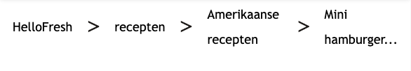

# Procesverslag
Markdown is een simpele manier om HTML te schrijven.  
Markdown cheat cheet: [Hulp bij het schrijven van Markdown](https://github.com/adam-p/markdown-here/wiki/Markdown-Cheatsheet).

Nb. De standaardstructuur en de spartaanse opmaak van de README.md zijn helemaal prima. Het gaat om de inhoud van je procesverslag. Besteedt de tijd voor pracht en praal aan je website.

Nb. Door *open* toe te voegen aan een *details* element kun je deze standaard open zetten. Fijn om dat steeds voor de relevante stuk(ken) te doen.

## Jij

  
uitwerken voor kick-off werkgroep

  ### Auteur:
  Caia van Haastrecht

  #### Je startniveau:
  blauw

  #### Je focus:
  surface plane
 

## Je website

  
uitwerken voor kick-off werkgroep

  ### Je opdracht:
  https://www.hellofresh.nl/?redirectLinkError=1&email=cpvh05%40protonmail.com 

  #### Screenshot(s) van de eerste pagina (small screen): 
  Homepagina 
  

  #### Screenshot(s) van de tweede pagina (small screen):
  receptenpagina
  
 

## Toegankelijkheidstest 1/2 (week 1)

  
uitwerken na test in 2e werkgroep

  ### Bevindingen
  Lijst met je bevindingen die in de test naar voren kwamen:
  - Doorgestreepte teksten worden niet duidelijk vermeld. Bijvoorbeeld bij het gebruik van kortingen waarbij de oude prijs wordt aangeduid d.m.v.
    een streep door de tekst.
  - De homepagina maakt gebruik van een animatie die steeds letters toevoegd om een woord te spellen. Bij het gebruik van een screenreader is dit
    zeer onpraktisch. Het wordt het namelijk totaal niet duidelijk van.
  - Niet elke afbeelding/icoon is goed aangegeven met een alternatieve tekst. Bij het gebruik van een screenreader wordt er namelijk alleen maar 
    vermeld dat het om een afbeelding gaat maar niet wat daarop te zien is. De afbeeldingen die wel een alternatieve tekst bevatten hebben geen 
    betekenisvolle tekst. 
  - Sommige delen van de tekst op de homepagina worden overgeslagen en niet voorgelezen.
  - De recepten op de detailpagina's (pop-up) worden op een onlogische volgorde voorgelezen. Het begint namelijk vanaf onderaan.

## Breakdownschets (week 1)

  
uitwerken na afloop 3e werkgroep

  ### de hele pagina: 
  
    

  ### dynamisch deel (bijv menu): 
  

## Voortgang 1 (week 2)

  
uitwerken voor 1e voortgang

  ### Stand van zaken
  Ik vond het erg lastig hoe ik de tweede pagina kon voorzien van eigen css, zonder in de knoop te komen met de vormgeving. Zo gebruikte ik namelijk steeds de nth-child. Op die manier wordt het op allebei de pagina's toegevoegd. 
  

  Daarnaast vond ik het lastig om een carrousel te maken. Ik wist dat ik de elementen in een list moest maken, maar vond het toch lastig om het horizontaal scrolbaar te maken.
  
  

  ### Agenda voor meeting
  Hier wat vragen die ik had voor de studentassistenten tijdens het feedbackuurtje:
  - Hoe gebruik ik nth-child bij bij meerdere html pagina’s zonder ze op allebei te gebruiken
  - Hoe kan ik de recepten op het homescherm als een carrousel maken. Zoals het ook op de originele site gebeurd?

  ### Verslag van meeting
  hier na afloop snel de uitkomsten van de meeting vastleggen

  - Zorg dat de lettertype in de body wordt aangeroepen, zodat ik dat niet iedere keer hoef te doen. Zo word ook de code netter
  - Zorg dat je de main van de tweede pagina een class geeft zodat ik de css op die manier kan aanroepen
  - gebruik een ul met daarin li-items. In de li moeten dan de losse elementen van de blokjes van de carrousel komen. Deze carrousel geef je de volgende css mee: 
    .carrousel {
    display: flex;
    flex-direction: row;
    overflow: auto;
    white-space: nowrap;
    }

## Voortgang 2 (week 3)

  
uitwerken voor 2e voortgang

  ### Stand van zaken
  hier dit ging goed & dit was lastig (neem ook screenshots op van delen van je website en code):

Ik vond het lastig om te bepalen wanneer een element een section of een div om zich heen moest hebben. Een div is namelijk bepaald voor alleen de vormgeving en een section moet je gebruiken wanneer er een tekst moet worden weergegeven. Soms gebruikte ik een section voor iets en dan kreeg ik later een info. Daarin werd dan verteld dat er een h1-h6 misde. 
  

Daarnaast had ik moeite met het aanpassen van de 
. Ik kon namelijk geen veranderinge aanbrengen in het type pijltje of de volgorde waarin het pijltje en de tekst verschenen. 
  

Daarentegen ging het vormgeven van de website wel al goed. Het begon al steeds meer op de website van Hello Fresh te lijken. 

  ### Agenda voor meeting
  - Wanneer is het gebruiken van een div legaal?
  - Hoe kan ik met css de details aanpassen?
  - Hoe krijg ik de nav op de recept pagina goed in plaats van hoe het er nu staat?
  - Hoe kan ik een svg in een html zetten?
  - Niet alle plaatjes op willen mee bewegen op de recept pagina.
  - Ik krijg een error bij het typen in de css. Is dit ernstig of kan ik dit negeren?

  ### Verslag van meeting
  hier na afloop snel de uitkomsten van de meeting vastleggen
  - Als ik stukjes gebruik die alleen vormgegeven moeten worden, maar geen heading hebben. 
  - De details zijn moeilijk vorm te geven, dus dat mocht ik laten zoals het er op dit moment uitziet.
  - Alles wat we (Danny en ik) geprobeerd hebben wilde niet werken. Dus heb ik het afgekort ingevuld.
  
  - Het in het html zetten van een svg heb ik uitgelegd gekregen en naar aanleiding daarvan in mijn html gezet. 

## Toegankelijkheidstest 2/2 (week 4)

  
uitwerken na test in 9e werkgroep

  ### Bevindingen
  Lijst met je bevindingen die in de test naar voren kwamen (geef ook aan wat er verbeterd is):

## Voortgang 3 (week 4)

  
uitwerken voor 3e voortgang

  ### Stand van zaken
  hier dit ging goed & dit was lastig (neem ook screenshots op van delen van je website en code)

  ### Agenda voor meeting
  - de logo's die ik gebruik zijn alleen maar facebook logo's. Hoe kan ik dit oplossen?
  - Hoe kan ik het scherm achter het hamburgermenu vastzetten, zodat scrollen niet mogelijk is. 
  - Waarom komt mijn nav (hamburgermenu niet in beeld bij het drukken op het icoontje)
  - Bij het gebruiken van de darkmode wordt het logo niet meegekleurd. Hoe kan ik dit oplossen?

  ### Verslag van meeting
  hier na afloop snel de uitkomsten van de meeting vastleggen

  - de :root aanpassen in de css en niet via de javascript. Dit heb ik gedaan door de volgende code in mijn javascript te zetten:
  /* bron: Hadil */
.darkmode {
    --primaire-achtergrond: black;
    --secudaire-achtergrond: rgb(33, 33, 33);
    --tertaire-achtergrond: rgb(100, 99, 99);
    --font-kleur-primair: white;
    --font-kleur-secundair: rgb(150, 150, 150);
    --font-kleur-tertair: rgb(113 113 113);
    --Fresh-groen: rgb(25 173 106);
}
De darkmode laat ik wel nog aanroepen door middel van javascript
  - door svg's te gebruiken die van de volgende website komen: https://icones.js.org/collection/all 
  - Door het toevoegen van een class op de body en deze laten aanroepen bij het openen van het hamburgermenu. De class zal ervoor zorgen dat je de body niet meer kunt scrollen.
  -  Ik moest daarvoor een ander javaScript bestand aanmaken, aangezien ik ook twee html pagina's heb en niet alle elementen op beide schermen voorkomen. 
- Door het logo van een achtergrond te voorzien. De achtergrond wordt alleen zichtbaar bij het activeren van de darkmode. 
  

## Eindgesprek (week 5)

  
uitwerken voor eindgesprek

  ### Je uitkomst - karakteristiek screenshots:
  

  ### Dit ging goed/Heb ik geleerd: 
  - Het maken van een light/darkmode
  
  
  
  - Het maken van een carrousel door middel van een horizontale scroll.
  
  - het maken van een dropdown door middel van het  details element. 
  
  
  - het gebruiken van svg's in mijn html pagina.
  - het gebruiken van een tabel in mijn html
  - Het gebruik maken van knoppen die de DOM-manipuleren (in dit geval gebruikt voor het aanpassen van hoeveelheden)
  - Het gebruiken van een knop die een 'lees meer' sectie opent

  

  ### Dit was lastig/Is niet gelukt:
  Korte omschrijving met plaatjes
  - de dropdowns aanpassen naar hoe het er op de originele website uitziet
  - door middel van javaScript een carrousel maken.

  

## Bronnenlijst

  
continu bijhouden terwijl je werkt

  Nb. Wees specifiek ('css-tricks' als bron is bijv. niet specifiek genoeg). 
  Nb. ChatGpT en andere AI horen er ook bij.
  Nb. Vermeld de bronnen ook in je code.

  1. https://www.sitepoint.com/style-html-details-element/
  2. https://blog.hubspot.com/website/horizontal-scrolling#:~:text=To%20enable%20horizontal%20scrolling%2C%20we,it%20accessible%20via%20horizontal%20scrolling.
  3. https://www.sitepoint.com/style-html-details-element/ 
  4. https://www.svgrepo.com/svg/445821/information-circle
  5. https://www.svgrepo.com/svg/421558/burger-menu 
  6. https://www.shecodes.io/athena/264278-how-to-prevent-content-from-overflowing-in-a-div-element 
  7. https://stackoverflow.com/questions/76693549/responsive-horizontally-scrollable-image-gallery
  8. https://www.flaticon.com/free-icon/down-arrow_2985150?term=down+arrow&related_id=2985150
  9. https://dlo.mijnhva.nl/content/enforced/609314-FDMCI-2000FED121-DMCI-CMD-2425/FED%2024-25%20-%20Blok%201%20-%20Oefening%20JS%203-stap.pdf
  10. https://developer.mozilla.org/en-US/docs/Web/API/IntersectionObserver
  11. https://medium.com/@burcuuusaglam/intersection-observer-in-javascript-and-lazy-load-images-38618f2c5864
  12. https://www.w3schools.com/howto/howto_js_read_more.asp 
  13. https://icones.js.org/collection/all
14. https://developer.mozilla.org/en-US/docs/Web/HTML/Element/td 

